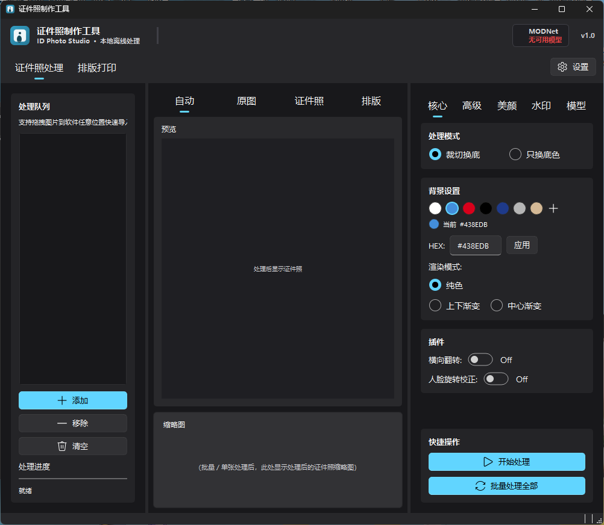
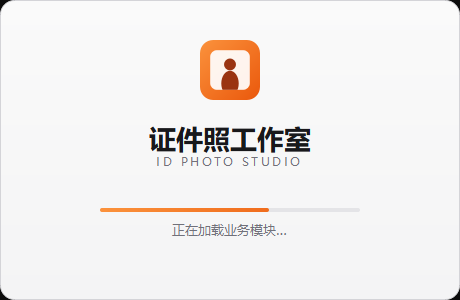

# 证件照制作工具 (ID Photo Studio)

> 一款**本地离线**运行的证件照制作软件，支持人像智能抠图、换底色、美颜、水印、标准/高清/透明底导出，以及 A4 多尺寸混排与一键打印。
>
> 基于开源项目 [HivisionIDPhotos](https://github.com/Zeyi-Lin/HivisionIDPhotos) 的算法思想二次开发，使用 **PySide6 + PyQt-Fluent-Widgets** 重写了现代化桌面界面，并对核心处理流水线做了独立验证与增强。
>
> 🔗 本项目开源地址：**https://github.com/jintianjie/idphoto_app**（免安装版见 [Releases](https://github.com/jintianjie/idphoto_app/releases)）

---

## 🌟 关于上游项目 HivisionIDPhotos

本软件的核心抠图与人脸检测算法、所用模型，均来源于开源项目 **[HivisionIDPhotos](https://github.com/Zeyi-Lin/HivisionIDPhotos)**（作者 Zeyi Lin 与 SwanLab Team）：

> ⚡️ HivisionIDPhotos：一个轻量级的 AI 证件照制作算法（*a lightweight and efficient AI ID photos tool*）。

上游的关键能力（本软件在其基础上做了**桌面化重构与增强**）：

- **轻量级抠图**：纯离线，仅需 **CPU** 即可快速推理；
- 按尺寸规格生成标准证件照、六寸排版照；
- 支持纯离线或端云推理；
- 内置美颜；
- 持续迭代特性：打印排版（六寸 / 五寸 / A4 / 3R / 4R）、人脸旋转对齐、自定义底色 HEX 输入、美式证件照背景、排版照裁剪线等。

上游采用 **Apache License 2.0**，本项目作为衍生作品沿用该许可证（详见 [许可证](#许可证)）。如本软件对你有帮助，也欢迎去上游仓库点个 Star ⭐。

---

## ✨ 特性

- 🖥️ **纯本地离线处理**：所有推理在本地完成，不上传任何图片，保护隐私。
- 🤖 **多模型抠图**：内置 4 套抠图模型，可按精度/速度自由选择：
  - `MODNet`（推荐，速度快）
  - `Hivision ModNet`（兼容好，发丝修复佳）
  - `RMBG-1.4`（精确度高，速度慢）
  - `BiRefNet-v1-lite`（精度最高，速度慢）
- 😀 **人脸检测**：`RetinaFace`（默认，准确率高）/ `MTCNN`（可选，轻量快速）。
- 🔄 **人脸摆正**：自动计算人脸倾斜角度，歪头照自动旋转校正（roll > 2° 时生效）。
- ↔️ **横向翻转**：一键镜像。
- 🎨 **换底色**：内置 白 / 蓝 / 红 / 黑 / 深蓝 / 浅灰 / 美式 七种预设，并支持任意自定义颜色；渲染模式支持 **纯色 / 上下渐变 / 中心渐变**。
- 💄 **美颜**：美白、磨皮等参数化调节滑块。
- 🔖 **水印**：文字水印，可调颜色与位置。
- 📐 **标准规格**：内置 一寸 / 小一寸 / 大一寸 / 二寸 / 小二寸 / 大二寸 / 护照 / 签证 / 驾照 / 社保卡 等常用规格预设，一键排版。
- 🗂️ **A4 混排排版**：支持**单一尺寸**与**多种尺寸混合排一页**（如「5 人各 1 寸 8 张 + 2 寸 5 张」自动紧凑排布），输出多页画布；支持自定义纸张规格。
- 🖨️ **打印**：调用系统打印对话框，自动记忆上次打印机；可开启「直接打印（跳过选择框）」。
- 📦 **批量处理**：拖拽或选择多张图片进入队列，批量出标准照 / 高清照 / 透明底。
- 💾 **灵活导出**：标准照 / 高清照 / 透明底抠图，支持 PNG / JPG；可设 **DPI（300/600）** 与 **KB 体积限制**（JPEG 自动压缩到目标大小）。
- ⬇️ **模型自动下载**：设置内一键检查并下载缺失模型，支持 **加速镜像源（hf-mirror）** 与 **原地址（GitHub/HuggingFace）** 双源自动回退；国内网络友好。
- 🎛️ **现代化 Fluent 界面**：深色主题、启动加载页、参数化布局常量，界面与业务逻辑严格分离。

---

## 📥 免安装版（GitHub Release）

不想装 Python 环境的用户，直接下载 **Releases** 页面提供的压缩包即可使用：

1. 打开本项目的 [Releases](https://github.com/jintianjie/idphoto_app/releases) 页面，下载最新版的 `idphoto_app_dist.zip`（约 110 MB）。
2. **右键 → 全部解压缩**，解压到任意英文路径（如 `D:\idphoto\`）。
3. 进入解压后的文件夹，双击 **`证件照制作工具.exe`** 即可运行（无需安装，无弹窗广告）。
4. 首次使用：进入 **设置 → 模型下载**，点击「一键检查并下载」获取抠图模型（推荐 MODNet，约 25 MB）；下载完成后即可正常制作证件照。

**系统要求**

| 项目 | 要求 |
| --- | --- |
| 操作系统 | Windows 10 / 11（64 位） |
| 内存 | 8 GB 及以上 |
| 显卡 | 无要求，纯 CPU 运行 |
| 其他 | 无需安装 Python / Node / 任何运行库（Win10/11 自带所需组件） |

**注意事项**

- ⚠️ 解压后文件夹里的 **`_internal` 子目录必须与 `证件照制作工具.exe` 保持在一起**（整个文件夹拷贝/移动，不要只拖 exe 出来），否则启动会报错。
- ⚠️ 建议存放路径为**纯英文、无空格**目录，避免个别系统环境下的路径兼容问题。
- 设置、日志与下载的模型默认保存在解压目录内，删除文件夹即完全卸载，不留注册表残留。
- 如果模型下载缓慢，可在设置中切换下载源（镜像 / 原地址）。

---

## 📸 界面概览

软件主界面分为顶部导航（**证件照处理** / **排版打印**）与三栏布局：

| 区域 | 内容 |
| --- | --- |
| 左栏 | 处理队列（缩略图 + 进度）/ 成品照 + 排版队列 |
| 中栏 | 预览画布（原图 / 证件照 / 排版 视图切换） |
| 右栏 | 参数面板（处理参数 / 排版参数） |

> 界面元素均来自 `PyQt-Fluent-Widgets` 原生控件，未使用自定义 QSS 皮肤。





---

## 🚀 快速开始

### 环境要求

- **Python 3.8+**（建议 3.10+）
- Windows / macOS / Linux（核心为 ONNX 推理，跨平台可用；UI 已在 Windows 充分验证）
- 约 2 GB 磁盘空间（含模型文件）

### 安装 Python 依赖

推荐在虚拟环境中安装，避免污染全局环境：

```bash
# 1. 创建并激活虚拟环境（可选但推荐）
python -m venv venv
#   Windows:
venv\Scripts\activate
#   macOS / Linux:
source venv/bin/activate

# 2. 安装全部依赖
pip install -r requirements.txt
```

国内网络可使用镜像加速（二选一）：

```bash
pip install -i https://pypi.tuna.tsinghua.edu.cn/simple -r requirements.txt
pip install -i https://mirrors.aliyun.com/pypi/simple/ -r requirements.txt
```

`requirements.txt` 依赖明细（必选 / 可选）：

| 包 | 版本要求 | 用途 | 必选 |
| --- | --- | --- | --- |
| `numpy` | >=1.21.0 | 数值计算 | ✅ |
| `opencv-python-headless` | >=4.5.0 | 图像处理（headless 版，避免与 Qt 冲突） | ✅ |
| `onnxruntime` | >=1.15.0 | ONNX 模型推理 | ✅ |
| `Pillow` | >=9.0.0 | 图像读写 | ✅ |
| `PySide6` | >=6.4.0 | Qt 绑定（GUI 基础） | ✅ |
| `pyside6-fluent-widgets` | 最新 | Fluent 风格组件（import 名 `qfluentwidgets`） | ✅ |
| `mtcnn-runtime` | >=1.0.0 | MTCNN 人脸检测（仅选 MTCNN 时需要） | ⬜ 可选 |

> **最小安装**（不要 MTCNN 时）：
> ```bash
> pip install numpy opencv-python-headless onnxruntime Pillow PySide6 pyside6-fluent-widgets
> ```
> 若后续要用 MTCNN 人脸检测，再补装：
> ```bash
> pip install mtcnn-runtime
> ```

### 准备模型

首次使用**无需手动下载全部模型**。软件采用「缺失即禁用、存在即可用」策略：

- 进入 **设置 → 模型下载**，点击「检查并下载缺失模型」，软件会从镜像/原地址自动拉取所需 ONNX 模型到 `model/` 目录；
- 或手动将以下模型放入 `model/` 目录（见下方 [模型清单](#模型清单)）；
- 抠图与人脸检测**各至少需要一个可用模型**即可开始处理。

### 启动

```bash
# 方式一：双击 run.bat（带启动加载页，自动检测/安装依赖）
run.bat

# 方式二：直接运行（无启动页）
python app.py
```

---

## 🧩 使用流程

1. **导入图片**
   - 点击「添加图片」从文件选择，或直接将图片文件**拖拽到软件任意位置**导入队列。
2. **选择模型与参数**（右栏「处理」面板）
   - 抠图模型、人脸检测模型、背景色/渲染模式、美颜、水印、DPI、KB 限制等。
3. **处理**
   - 单张「开始处理」或「批量处理」，进度实时显示在队列缩略图上。
4. **换底色 / 导出**
   - 处理完成后在「排版打印」页可继续排版，或直接导出标准照 / 高清照 / 透明底。
5. **排版打印**
   - 在排版页添加尺寸条目（如 一寸 ×8、二寸 ×5），点击「生成排版」得到 A4 多页画布，再一键打印。

---

## 🗂️ 模型清单

模型统一存放于 `model/` 目录。下载配置见 `model_download_config.json`。

| 模型文件 | 类型 | 说明 | 体积 | 自动下载 |
| --- | --- | --- | --- | --- |
| `modnet_photographic_portrait_matting.onnx` | 抠图 | MODNet 官方权重，速度快 | ~24.7 MB | ✅ |
| `hivision_modnet.onnx` | 抠图 | 对纯色换底适配性更好的抠图模型，发丝修复佳 | ~24.7 MB | ✅ |
| `rmbg-1.4.onnx` | 抠图 | BRIA AI 开源抠图模型，精度高 | ~176.2 MB | ✅ |
| `birefnet-v1-lite.onnx` | 抠图 | ZhengPeng7 开源，拥有最好的分割精度 | ~224 MB | ✅ |
| `retinaface-resnet50.onnx` | 人脸检测 | RetinaFace，默认人脸检测 | ~104 MB | ✅ |
| `mtcnn*` | 人脸检测 | MTCNN，可选，轻量快速 | 自动下载 | 首次选择时下载 |

> 模型来源遵循上游项目与对应作者许可：MODNet / hivision_modnet / RetinaFace 来自 HivisionIDPhotos 发布页；RMBG-1.4 来自 BRIA AI；BiRefNet 来自 ZhengPeng7。请遵守各自许可证。
>
> 上游还提供 `scripts/download_model.py --models all` 一键脚本与 **SwanHub** 备用下载源；本软件已将其集成到设置内的「一键下载」中，无需单独执行上游脚本。

### 手动下载地址

若不想用软件内「一键下载」，也可手动下载后放入 `model/` 目录。下表为 `model_download_config.json` 中的真实地址（**原地址** 与 **加速镜像** 二选一即可，国内推荐镜像）。

| 本地文件名 | 类型 | 原地址（GitHub / HuggingFace） | 加速镜像（hf-mirror） |
| --- | --- | --- | --- |
| `modnet_photographic_portrait_matting.onnx` | 抠图 | `https://github.com/Zeyi-Lin/HivisionIDPhotos/releases/download/pretrained-model/modnet_photographic_portrait_matting.onnx` | `https://hf-mirror.com/DavG25/modnet-pretrained-models/resolve/main/models/modnet_photographic_portrait_matting.onnx` |
| `hivision_modnet.onnx` | 抠图 | `https://github.com/Zeyi-Lin/HivisionIDPhotos/releases/download/pretrained-model/hivision_modnet.onnx` | `https://hf-mirror.com/xiaofennuonuo/comfyui/resolve/main/hivision_modnet.onnx` |
| `rmbg-1.4.onnx` ⚠️ | 抠图 | `https://huggingface.co/briaai/RMBG-1.4/resolve/main/onnx/model.onnx?download=true` | `https://hf-mirror.com/briaai/RMBG-1.4/resolve/main/onnx/model.onnx` |
| `birefnet-v1-lite.onnx` ⚠️ | 抠图 | `https://github.com/ZhengPeng7/BiRefNet/releases/download/v1/BiRefNet-general-bb_swin_v1_tiny-epoch_232.onnx` | `https://hf-mirror.com/EmmaJohnson311/TensorRT-ONNX-collect/resolve/main/BiRefNet-v2-onnx/BiRefNet-general-bb_swin_v1_tiny-epoch_232.onnx` |
| `retinaface-resnet50.onnx` | 人脸 | `https://github.com/Zeyi-Lin/HivisionIDPhotos/releases/download/pretrained-model/retinaface-resnet50.onnx` | `https://hf-mirror.com/TheEeeeLin/HivisionIDPhotos_matting/resolve/main/retinaface-resnet50.onnx` |

> ⚠️ **重命名提示**：
> - `rmbg-1.4` 原始文件名是 `model.onnx`（带 `?download=true` 查询参数），下载后请**重命名为 `rmbg-1.4.onnx`** 再放入 `model/`。
> - `birefnet-v1-lite` 原始文件名是 `BiRefNet-general-bb_swin_v1_tiny-epoch_232.onnx`，下载后请**重命名为 `birefnet-v1-lite.onnx`**。
> - `mtcnn` 权重由 `mtcnn-runtime` 包在首次选择该检测模型时自动下载，无需手动获取。

---

## 🔧 工具箱：高速下载配置生成器（作者侧）

软件内的「高速下载」功能（设置 → 模型下载 → 高速下载，密码门控）所需的加密配置文件，由作者侧的「工具箱」生成。该工具箱**不随用户分发**，仅供维护者使用。

核心思路：作者填入「软件密码」+ 高速下载直链 → 用密码作为密钥加密 → 产出 `model_download_config.json` 的 `highspeed_downloads` 字段。主程序**只读不写**：用户输入密码，解密（MAC 校验通过即解锁）后拿到直链下载。**密码即解密密钥**，JSON 内不另存密码、也无「重置 / 改密」入口；直链失效时，作者重新生成这份 JSON 发给用户即可。

工具箱包含两个组件：

### 1. 图形化生成器 `tools/mirror_builder/`

双击 `tools/mirror_builder/运行生成器.bat` 启动（PySide6 + Fluent 风格，与主程序同源）。支持多种粘贴格式批量导入地址：

```
rmbg-1.4.onnx:
https://drfs.ctcontents.com/file/.../rmbg-1.4.onnx

rmbg-1.4.onnx: https://...        # 名称与地址同行
rmbg-1.4.onnx = https://...        # 等号 / 竖线 / 制表符分隔均可
https://.../rmbg-1.4.onnx          # 仅地址，名称自动取末段
```

命令行（无需 GUI 库，适合批量 / 无界面环境）：

```bash
python tools/mirror_builder/mirror_builder.py --cli -i urls.txt -p 密码 -o model_download_config.json
python tools/mirror_builder/mirror_builder.py --cli --dump -p 密码 -i model_download_config.json
```

### 2. 命令行加密工具 `tools/encrypt_mirrors.py`

用于对已有的 `highspeed_downloads` 明文做加密 / 校验 / 解密自检：

```bash
# 加密并写回（--password 即用户解锁要输入的密码 / 解密密钥）
python tools/encrypt_mirrors.py encrypt --password myPwd
python tools/encrypt_mirrors.py encrypt --password myPwd --input custom.json --out /path/to/config.json

# 检查 / 解密导出
python tools/encrypt_mirrors.py check --password myPwd
python tools/encrypt_mirrors.py decrypt --password myPwd --in encrypted.json --out plain.json
```

> 普通用户无需接触工具箱——直接走设置内的「一键下载」（加速镜像 / 原地址双源）即可获取全部模型。工具箱仅用于维护高速直链通道。加密算法见 `core/secure_json.py`（PBKDF2-SHA256 + SHA256-CTR + HMAC-SHA256），生成器与核心共用同一实现。

---

## 🏗️ 项目结构

```
idphoto_app/
├── app.py                     # 主控制器：状态 + 业务逻辑 + 信号接线（不含 UI 绘制）
├── launcher.py                # 入口（带启动加载页，按需分步导入重型依赖）
├── run.bat                    # Windows 一键启动（依赖自检 + 启动页）
├── requirements.txt
├── model_download_config.json # 模型下载地址（mirror / original 双源）
│
├── core/                      # 基础设施
│   ├── settings_store.py      # 设置读写（JSON，持久化记忆上次选择/参数）
│   ├── mirror_manager.py      # 加速镜像通道管理
│   └── secure_json.py         # 加密 JSON 读写（高速下载等敏感配置）
│
├── ui/                        # 界面层（视图 + 控件 + 主题，不含业务逻辑）
│   ├── theme.py               # Fluent 主题应用 + 统一标签工厂
│   ├── process_view.py        # 「证件照处理」参数面板（核心/高级/美颜/水印/模型）
│   ├── layout_view.py         # 「排版打印」参数面板 + 自定义纸张规格
│   ├── preview_pane.py        # 预览画布（原图/证件照/排版 视图切换）
│   ├── queue_pane.py          # 处理队列（缩略图 + 进度）
│   ├── layout_left_pane.py    # 排版左栏（成品照 + 排版队列）
│   ├── widgets.py             # 复用型 Fluent 控件封装
│   ├── settings_dialog.py     # 设置对话框（模型下载 / 打印 / 自定义纸张）
│   ├── model_download_dialog.py
│   ├── mirror_dialog.py
│   ├── highspeed_gate_dialog.py  # 高速下载密码门控
│   └── splash.py              # 启动加载页
│
├── inference.py               # 模型推理引擎（抠图 + RetinaFace ONNX 懒加载）
├── photo_processor.py         # 证件照处理流水线（抠图/人脸/裁剪/换底/美颜/水印）
├── layout_engine.py           # 排版引擎（单一/混合尺寸，多页画布）
├── image_utils.py             # 图像工具（resize/换底/美颜/水印/DPI/KB 限制保存）
├── color_utils.py             # 颜色转换
├── model_downloader.py        # 模型下载（双源 + 镜像 + 高速加密通道）
├── styles.py                  # 颜色/字体/间距/尺寸/规格预设 等常量集中管理
├── test_all.py                # 统一验收测试入口
│
└── tools/                     # 作者侧工具箱（不随用户分发）
    ├── encrypt_mirrors.py     # 高速下载配置命令行加密 / 校验 / 解密工具
    └── mirror_builder/        # 高速下载配置图形化生成器（双击 运行生成器.bat）
```

### 架构原则

- **UI 与业务逻辑严格分离**：`app.py` 只持有状态、编排逻辑、连接信号；所有控件外观与布局封装在 `ui/`；后端模块（`inference` / `photo_processor` / `layout_engine` / `image_utils`）保持纯逻辑、可独立复用与单测。
- **常量集中管理**：颜色、字号、间距、窗口尺寸、规格预设全部集中在 `styles.py`，便于统一调整界面，禁止散写样式数值。
- **线程安全**：后台推理在 worker 线程执行，UI 刷新通过线程安全队列 + 主线程 `QTimer` 轮询回调（规避 `QTimer.singleShot` 在子线程静默失效的坑）。

---

## 🔧 自定义与配置

### 界面布局微调

`styles.py` 顶部集中了可调常量，注释详尽，无需改动业务代码即可调整：

- **字号**：`FONT_TITLE / FONT_HEADING / FONT_BODY / FONT_SMALL / FONT_BUTTON / FONT_STATUS`
- **间距**：`PAD_*` / `GAP_*`
- **窗口与栏尺寸**：`WINDOW_WIDTH / WINDOW_HEIGHT / TOP_NAV_HEIGHT / STATUSBAR_HEIGHT / TITLEBAR_HEIGHT`
- **预览画布**：`PREVIEW_A4_WIDTH / PREVIEW_A4_HEIGHT`
- **全局字号缩放**：`UI_FONT_SCALE`（0.8~1.0，设置里 `ui.font_scale` 可覆盖）
- **规格预设**：`PRESET_SIZES`（尺寸名 → 高×宽 像素）、`DEFAULT_COUNT_BY_SIZE`（每规格默认排版数量）

### 模型下载源

`model_download_config.json`：

- `manifest`：每个模型的 `filename / original（GitHub/HF 原地址）/ mirror（hf-mirror 加速地址）`；
- `preferred_source`：`"mirror"`（默认，国内优先）或 `"original"`；
- `default_timeout`：单模型下载超时（秒）；
- `highspeed_downloads`：加密的高速直链通道（需密码，私有，可选）。

### 设置项（持久化）

设置保存在 `settings.json`，包含：上次选择的抠图/人脸模型、背景色、DPI/KB 默认值、默认下载源、自定义纸张规格、是否跳过打印对话框、字体缩放、窗口标题等。修改后软件自动记忆，无需重复配置。

---

## ✅ 核心算法说明

本工具的核心抠图与人脸检测流水线移植自 HivisionIDPhotos，并做了独立一致性验证：

- 同图同尺寸（413×295）对比开源实现，蒙版 **IoU ≈ 0.737**，蒙版总面积几乎相等（差异仅来自边缘羽化亚像素阈值），**产出一致**；
- 忠实复刻了关键步骤：`adjust_photo` 裁剪构图、`get_box(model=2)` 非透明边界、RetinaFace 预处理（`img - (104,117,123)` + RGB + transpose）、PriorBox / 框与关键点解码、MODNet 预处理（512 / BGR / `(x/255-0.5)/0.5`）；
- 抠图模型使用动态输入节点名适配不同权重（`get_inputs()[0].name`）；
- 相较上游的增强：① 补回了被禁用的**人脸旋转校正**；② 背景色/渲染模式/美颜/水印在 UI 层完整串联；③ 处理页产出通用照（1400×1000），尺寸裁切下移到排版页按规格「覆盖式居中裁切」。

> 说明：水平翻转（`cv2.flip(.,1)`）已在 UI 层实现；美颜作用于已裁剪成品（上游在 matting 后、crop 前作用全图），位置差异属有意设计。

---

## 🧪 测试

项目自带验收脚本：

```bash
python test_all.py            # 统一测试入口
python _smoke_qt.py           # Qt 冒烟测试（offscreen 下校验 UI 构建与核心链路）
```

---

## 📦 从源码打包为 exe（Windows）

项目提供一键打包脚本 `build_exe.bat`（PyInstaller，onedir + 无控制台窗口）。双击即可，脚本会
自动定位 Python、校验 PyInstaller 与依赖、清理缓存、打包、剔除冗余 DLL 并统计体积。

```bat
build_exe.bat              完整流程（推荐）
build_exe.bat /nodeps      跳过依赖检查（依赖已就绪时更快）
build_exe.bat /noslim      跳过 DLL 瘦身
build_exe.bat /zip         额外压缩为 dist\证件照制作工具_日期.zip
build_exe.bat /smoke       打包后试启动 8 秒，验证 exe 能否存活
build_exe.bat /console     生成带控制台的版本（排错用）
build_exe.bat /nopause     结束时不暂停（自动化 / CI）
build_exe.bat /upx         用 UPX 压缩大文件（需自备 upx.exe）
build_exe.bat /clean       只清理构建缓存
```

**体积对照**

| 方式 | 体积 | 说明 |
| --- | --- | --- |
| 默认 | 225.8 MB | 稳妥版，不加壳 |
| `/upx` | 119.9 MB | 主要压 `cv2.pyd`（82.3 → 20.3 MB）与 numpy OpenBLAS |

> `/upx` 默认关闭：部分杀软对加壳文件会误报，是否启用请自行权衡。
> 实测开启后窗口出现耗时 0.53 秒，启动并无明显变慢；需要时把 `upx.exe` 放到脚本同目录或加入 PATH。
> 打包耗时：默认约 60 秒，开启 `/upx` 约 120 秒。

**产物结构**：`dist\证件照制作工具\`，主程序在顶层，依赖统一收纳在 `_internal\`。整个文件夹即为可分发包，双击 `证件照制作工具.exe` 即可运行。

**数据存放位置（重要）**

| 运行方式 | 设置 / 模型 / 日志 |
| --- | --- |
| 源码运行（`python launcher.py`） | 项目根目录：`settings.json`、`model\`、`run_bat.log` |
| 打包运行 | `%LOCALAPPDATA%\证件照制作工具\` |

打包版不写程序目录是有原因的：程序若装在 Program Files，该目录无写权限，会导致设置存不下、
模型下载不了；且每次重新打包都会清空 `_internal`，已下载的模型会跟着丢失。
随程序分发的只读配置（`model_download_config.json`）仍留在程序目录内。

**自动剔除**：打包后会删掉不影响启动与图像功能的冗余文件——cv2 的视频 FFmpeg 库、软件 OpenGL 后备、
未使用的 Qt Quick / Qml / Pdf / Multimedia / 虚拟键盘、Qt 自带翻译文件、Pillow 的 AVIF 插件等，
相比不瘦身约减重 36 MB（`/noslim` 可关闭）。

- 初始包**不含模型**，首次使用通过「设置 → 模型下载」获取，因此包体积小、下载后即用。
- 可选功能 MTCNN 人脸检测：打包环境装了 `mtcnn-runtime` 时会自动带上代码与权重；未安装则该选项不可用（默认 RetinaFace 不受影响）。
- 同时提供 `证件照制作工具.spec`，参数与 `build_exe.bat` 一致，便于 CI 或手工微调（`pyinstaller 证件照制作工具.spec`）。

---

## 📋 许可证

本项目基于 [HivisionIDPhotos](https://github.com/Zeyi-Lin/HivisionIDPhotos) 二次开发，核心算法思想与部分模型来源于该项目及其依赖（MODNet / RetinaFace / BiRefNet / RMBG-1.4 / MTCNN）。

- **上游许可证**：HivisionIDPhotos 采用 **Apache License 2.0**。
- **本项目许可证**：作为衍生作品，本项目沿用 **Apache License 2.0**，全文见仓库根目录 `LICENSE` 文件。

> 依据 Apache 2.0 要求： redistributing 衍生作品须附带本许可证、保留原作者版权与署名声明，并标注对源文件的修改。请在分发本项目时遵守上述条款。

---

## 🙏 致谢

- [HivisionIDPhotos](https://github.com/Zeyi-Lin/HivisionIDPhotos)（Apache 2.0，作者 Zeyi Lin 与 SwanLab Team）—— 证件照算法与模型来源
- [PyQt-Fluent-Widgets](https://github.com/zhiyiYo/PyQt-Fluent-Widgets) —— Fluent 风格 UI 组件
- MODNet / RetinaFace / BiRefNet / RMBG-1.4 / MTCNN 等模型的原作者与发布者
- [hf-mirror.com](https://hf-mirror.com) —— 国内友好的模型加速镜像

### 引用

如果在研究或项目中使用了 HivisionIDPhotos（包括其算法与模型），请引用上游工作：

```bibtex
@misc{hivisionidphotos,
      title={{HivisionIDPhotos: A Lightweight and Efficient AI ID Photos Tool}},
      author={Zeyi Lin and SwanLab Team},
      year={2024},
      publisher={GitHub},
      url = {\url{https://github.com/Zeyi-Lin/HivisionIDPhotos}},
}
```
